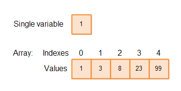

# Arrays


## Declarando um array
```java
int[] idade = new int[10];
int[] ficha = { 1,2,3,4,5,6,7,8,9,10 };
```
## Acessando um elemento com seu index
```java
ficha[2];
```
## Trocar o elemento de acordo com o index
```java
ficha[2] = 3;
```

# ArraysList

## Declarando um ArrayList

```java
ArrayList<Integer> idade = new ArrayList<>();
```
